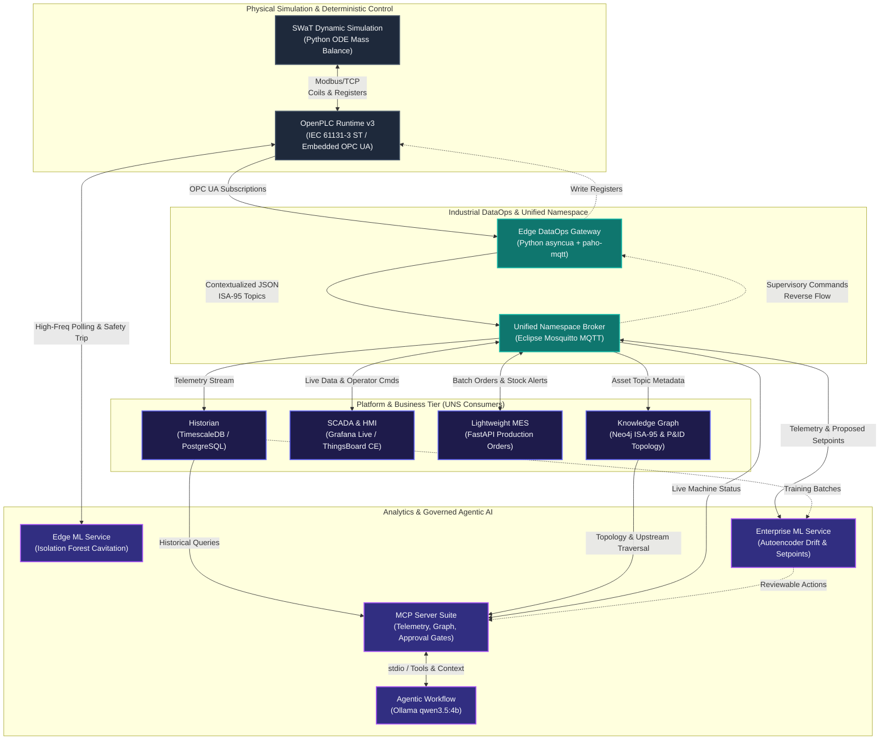

# Master Implementation Roadmap: Autonomous Industrial Plant Architecture

## Executive Summary
This document defines an end-to-end, first-principles roadmap for building an OEM-agnostic, locally hosted Industrial DataOps and AI architecture. 

The architecture decouples deterministic OT safety and control (OpenPLC + SWaT dynamic simulation) from contextual data infrastructure (Unified Namespace on MQTT, TimescaleDB Historian, Neo4j Knowledge Graph, and UNS-connected SCADA/HMI). It bridges edge ML anomaly detection with higher-level Agentic AI diagnostic workflows governed by the Model Context Protocol (MCP) and local LLMs (`qwen3.5:4b` via Ollama).

---

## System Architecture

## Execution Phases

### Phase 0: Workspace & Repository Setup

**Objective:** Establish the foundational Git repository, documentation scaffolding, Docker network topology, and development environment.

#### Deliverables

1. **GitHub Repository Initialization:**
    
    - Repository structure separating concerns (`docker/`, `src/`, `config/`, `docs/`, `tests/`).
        
    - Root `.gitignore` excluding Python virtual environments, compiled PLC artifacts, and credential files.
        
    - Multi-stage environment configuration (`.env.example`).
        
2. **Docker Orchestration Scaffold:**
    
    - Central `docker-compose.yml` declaring an isolated internal network (`industrial-network`) to host all services.
        
3. **Python Development Setup:**
    
    - Unified `pyproject.toml` or `requirements.txt` pinning core libraries (`pymodbus`, `asyncua`, `paho-mqtt`, `pydantic`, `scikit-learn`, `fastapi`, `neo4j`, `psycopg2-binary`, `ollama`, `mcp`).
        

#### Verification Gate

- Repository clones cleanly.
    
- `docker compose config` validates without errors.
    
- Local Python virtual environment activates and imports all dependencies cleanly.
    

### Phase 1: OT Foundation & Simulation Setup

**Objective:** Deploy the open-source SWaT continuous process simulation and couple it with OpenPLC Runtime v3 in Docker.

#### Deliverables

1. **Containerized OpenPLC Runtime:**
    
    - OpenPLC v3 Docker service exposing port `502` (Modbus/TCP) and port `4840` (OPC UA).
        
2. **SWaT Process Physics Simulator:**
    
    - Standalone Python daemon modeling Stage 1 (Raw Infeed, Dosing) and Stage 2 (Clarification) using first-principles mass balance equations ($\frac{dV}{dt} = Q_{in} - Q_{out}$).
        
    - Modbus synchronization loop updating sensor registers (%IW) and reading actuator coils (%QX) at 100 ms intervals.
        
3. **OpenPLC IEC 61131-3 Control Logic:**
    
    - Structured Text (`.st`) program implementing start/stop latching, tank high/low cutoffs, pump permissives, and emergency interlocks.
        
4. **Deterministic OT Smoke Test:**
    
    - Python test script reading holding registers and toggling coils via `pymodbus` to prove end-to-end loop stability.
        

#### Verification Gate

- Tank level values dynamically rise and fall in response to pump states.
    
- Tripping the simulated high-level float trips the OpenPLC interlock and stops the feed pump within one scan cycle.
    

### Phase 2: Industrial DataOps Gateway & Unified Namespace

**Objective:** Contextualize raw PLC tags into a structured, vendor-neutral MQTT Unified Namespace.

#### Deliverables

1. **MQTT Broker Service:**
    
    - Eclipse Mosquitto container with persistent storage and local listeners enabled on port `1883`.
        
2. **DataOps Gateway Service (`src/gateway.py`):**
    
    - Connects to OpenPLC via OPC UA (`asyncua`) to read named variables.
        
    - Normalizes values with strict `pydantic` models: ISO 8601 timestamps, engineering units, quality flags (`GOOD`, `UNCERTAIN`, `BAD`), and asset identifiers[cite: 1, 2, 3].
        
    - Publishes JSON payloads to the UNS topic hierarchy: `swat_water/plant1/dosing/line1/chemical_tank/telemetry`
        
3. **Bidirectional Command Consumer:**
    
    - Subscribes to supervisory command topics (e.g., `swat_water/plant1/dosing/line1/chemical_tank/cmd`) to translate validated UNS commands back into OpenPLC writes.
        

#### Verification Gate

- `mosquitto_sub -t "swat_water/#" -v` displays structured JSON payloads at regular intervals.
    
- Simulated network interruptions trigger the gateway's auto-reconnect logic without crashes or dropped states.
    

### Phase 3: Historian & Knowledge Graph Backbone

**Objective:** Establish persistent time-series storage and seed the physical plant ontology in a graph database.

#### Deliverables

1. **TimescaleDB Container:**
    
    - PostgreSQL container with the TimescaleDB extension mounted to persistent local storage.
        
2. **Historian Ingestion Service:**
    
    - Lightweight Python daemon subscribing to `swat_water/+/+/+/+/telemetry`, batch-inserting metrics into an optimized hypertable chunked by time.
        
3. **Neo4j Community Container:**
    
    - Graph database service accessible via Bolt (`7687`) and HTTP (`7474`).
        
4. **Deterministic Graph Seeding Script:**
    
    - Cypher script modeling the ISA-95 asset hierarchy and physical P&ID flow:
        
        - Nodes: `Enterprise`, `Site`, `Area`, `Line`, `Equipment`, `Pipe`, `Sensor`.
            
        - Directed relationships: `[:FEEDS]`, `[:DISCHARGES_TO]`, `[:MONITORS]`.
            

#### Verification Gate

- TimescaleDB logs telemetry rows with sub-millisecond query retrieval for rolling trends.
    
- Neo4j browser renders the connected topology showing pipe connections between the dosing tank and clarifier.
    

### Phase 4: UNS-Native SCADA, HMI & Lightweight MES

**Objective:** Provide real-time operational visualization and production scheduling directly over the UNS.

#### Deliverables

1. **SCADA & Operator HMI (Grafana Live / ThingsBoard CE):**
    
    - Real-time HMI dashboard subscribing directly to MQTT UNS topics for live tank levels, flow rates, and valve states.
        
    - Historical trend graphs reading directly from TimescaleDB.
        
    - Operator Action Panel: UI controls that publish command payloads to the UNS command topics.
        
2. **Lightweight MES Service (FastAPI):**
    
    - Production order API exposing endpoints to submit batch targets (e.g., Target: $250\text{ m}^3$, Turbidity $< 0.5\text{ NTU}$).
        
    - Publishes batch status to `swat_water/plant1/dosing/line1/orders`.
        
    - Consumable tracking logic calculating chemical depletion and publishing inventory alerts onto the UNS.
        

#### Verification Gate

- Moving a valve or starting a pump reflects on the HMI dashboard within 500 ms.
    
- Submitting a production order through FastAPI updates the order status displayed on the SCADA view.
    

### Phase 5: Machine Learning & Process Optimization Services

**Objective:** Implement edge-native protection and enterprise-level process optimization.

#### Deliverables

1. **Edge ML Anomaly Detector (Sub-Second Ingestion):**
    
    - Unsupervised `scikit-learn` Isolation Forest service monitoring high-frequency pump current, vibration, and flow rates.
        
    - Writes an immediate fault bit to an OpenPLC register when cavitation or mechanical binding is detected.
        
2. **Enterprise ML Service (Seconds-to-Minutes Ingestion):**
    
    - _Sensor Drift Detector:_ Statistical or Autoencoder model flagging calibration drift (e.g., mass balance divergence between flow in and tank level rate of change).
        
    - _Setpoint Optimizer:_ Constrained optimizer proposing energy/chemical-efficient setpoints published to `.../optimization/proposed_setpoints`.
        

#### Verification Gate

- Injecting simulated pump cavitation triggers the edge model and faults the pump in OpenPLC within two seconds.
    
- Drift detector logs an alert to the UNS when synthetic offset is injected into a level transmitter.
    

### Phase 6: Governed Agentic AI Layer

**Objective:** Connect local LLMs (`qwen3.5:4b` via Ollama) to governed tools using Model Context Protocol (MCP) servers to assist plant engineering and operations.

#### Deliverables

1. **MCP Server Suite:**
    
    - `telemetry-mcp`: Exposes read-only tools `get_machine_status(asset_id)` and `get_time_series_window(tag, start, end)`.
        
    - `topology-mcp`: Cypher-backed tool querying Neo4j for upstream/downstream dependencies during root-cause investigations.
        
    - `approval-mcp`: Enforces human approval tokens for proposed setpoint writes, generating diffs for engineer sign-off.
        
2. **Local Diagnostic Agent:**
    
    - Interactive agent running on Ollama using function calling against MCP tools.
        
    - Evaluates alarms, traverses the Neo4j topology to isolate upstream equipment causes, verifies history in TimescaleDB, and produces evidence-backed diagnostic reports.
        

#### Verification Gate

- Alarmed state $\to$ Agent queries telemetry $\to$ Agent traverses graph to check upstream feeding pump $\to$ Agent identifies root cause and drafts a diagnostic summary citing exact timestamps, with all unapproved write actions strictly blocked[cite: 1, 3].