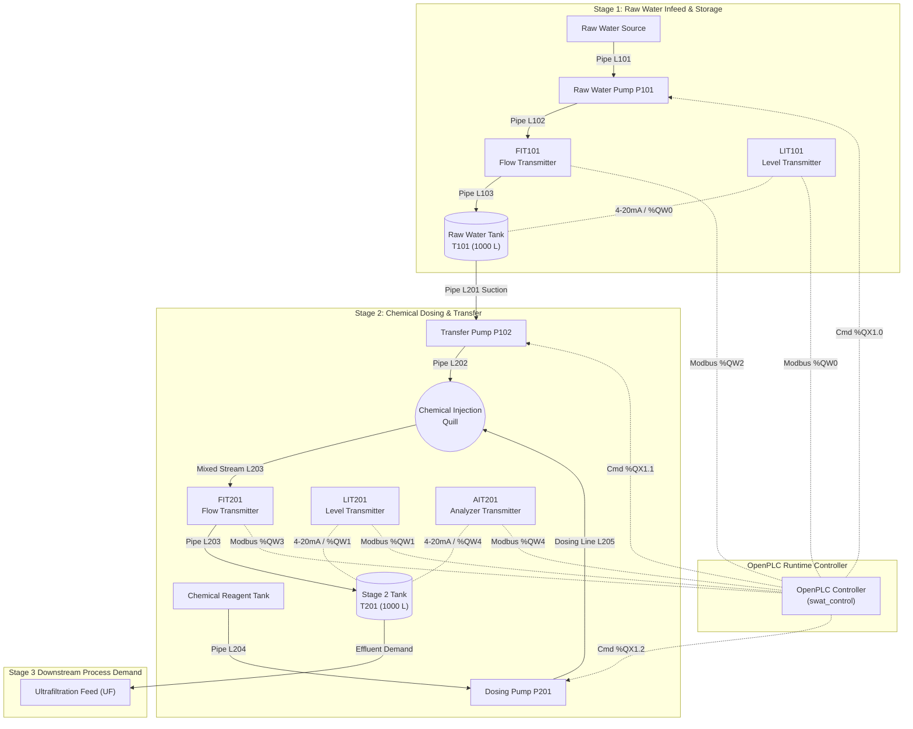

# Piping & Instrumentation Diagram (P&ID) Specification
**Document ID:** SWaT-DOC-PID-001  
**Plant Area:** Stage 1 (Raw Water Infeed & Storage) & Stage 2 (Chemical Pre-treatment & Dosing)  
**Standard:** ANSI/ISA-5.1-2009 (Instrumentation Symbols and Identification)  
**Revision:** 1.0.0  

---

## 1. Process Overview & Boundary

The SWaT (Secure Water Treatment) process simulated in this project models the initial continuous purification stages of an industrial municipal/industrial water treatment facility:

- **Stage 1 (Primary Infeed & Storage):** Raw water intake from municipal or natural reservoir supply, metering via flow transmitter `FIT101`, and storage in buffer tank `T101`. Level monitoring is performed continuously by `LIT101`.
- **Stage 2 (Chemical Pre-treatment & Coagulation):** Transfer of raw water from `T101` to coagulation tank `T201` via transfer pump `P102`. Inline dosing of chemical reagent (coagulant / disinfectant) by metering pump `P201` into the transfer line. Monitoring of line flow rate by `FIT201`, chemical concentration by `AIT201`, and vessel volume by `LIT201`.

```
[Raw Supply] ---> (P101) ---> [FIT101] ---> [ Tank T101 ]
                                                  |
                                                (P102) ---> [FIT201] ---> [ Tank T201 ] ---> [Stage 3 UF]
                                                  ^            ^                 |
                                                  |            |              [AIT201]
                                           (Chemical Drum) -> (P201)
```

---

## 2. P&ID Schematic Diagram



---

## 3. Equipment Schedule

| Tag | Equipment Name | Type / Technology | Nominal Capacity / Rating | Design Pressure | Material |
| :--- | :--- | :--- | :--- | :--- | :--- |
| **T101** | Raw Water Storage Tank | Vertical Cylindrical Atmospheric Vessel | 1,000 L (Operating range 0–1,000 mm) | Atmospheric | HDPE / 316L SS |
| **T201** | Coagulation / Stage 2 Tank | Vertical Cylindrical Atmospheric Vessel | 1,000 L (Operating range 0–1,000 mm) | Atmospheric | HDPE / 316L SS |
| **P101** | Raw Water Infeed Pump | Centrifugal In-line Pump | 2.5 L/s (150 L/min, ~9.0 m³/h) @ 2.5 bar | PN10 | 316L SS Impeller |
| **P102** | Water Transfer Pump | Centrifugal Booster Pump | 2.0 L/s (120 L/min, ~7.2 m³/h) @ 2.0 bar | PN10 | 316L SS Impeller |
| **P201** | Chemical Dosing Pump | Positive Displacement Diaphragm Metering | 0.05 L/s (3.0 L/min, 180 L/h) @ 4.0 bar | PN16 | PTFE Diaphragm / PVDF Head |

---

## 4. Instrumentation Index

Following ISA-5.1 naming convention:
- **First Letter:** Variable (`L` = Level, `F` = Flow, `A` = Analysis/Analytical).
- **Succeeding Letters:** Modifier & Function (`I` = Indicator, `T` = Transmitter).

| Tag | Instrument Description | Measured Variable | Calibrated Range | Engineering Units | Output Signal | OpenPLC Address | Fail-Safe State |
| :--- | :--- | :--- | :--- | :--- | :--- | :--- | :--- |
| **LIT101** | Tank 101 Level Transmitter | Water level in T101 | 0.0 – 1000.0 | mm | 4–20 mA (Modbus 0–1000 INT) | `%QW0` | Low / 0 mm |
| **LIT201** | Tank 201 Level Transmitter | Water level in T201 | 0.0 – 1000.0 | mm | 4–20 mA (Modbus 0–1000 INT) | `%QW1` | Low / 0 mm |
| **FIT101** | Infeed Flow Transmitter | Discharge flow rate of P101 | 0.0 – 300.0 | L/min | 4–20 mA (Modbus 0–300 INT) | `%QW2` | 0 L/min |
| **FIT201** | Transfer Flow Transmitter | Transfer flow rate of P102 | 0.0 – 300.0 | L/min | 4–20 mA (Modbus 0–300 INT) | `%QW3` | 0 L/min |
| **AIT201** | Chemical Concentration Analyzer | Reagent concentration in T201 | 0.0 – 100.0 | ppm (mg/L) | 4–20 mA (Modbus 0–100 INT) | `%QW4` | High / 100 ppm |

---

## 5. Actuator & Valve Index

| Tag | Actuator Description | Drive Type | Modbus Control Coil | Modbus Run Status | Interlock Inputs |
| :--- | :--- | :--- | :--- | :--- | :--- |
| **P101** | Raw Water Pump Motor | Fixed Speed Induction (DOL / VFD) | `%QX0.0` (Start), `%QX0.1` (Stop) | `%QX1.0` (Run feedback) | Tripped by `alarm_raw_hh` (`%QX1.3`) or `E-Stop` (`%QX0.4`) |
| **P102** | Transfer Pump Motor | Fixed Speed Induction (DOL / VFD) | `%QX0.2` (Start), `%QX0.3` (Stop) | `%QX1.1` (Run feedback) | Inhibited/Tripped by `alarm_raw_ll` (`%QX1.4`), `alarm_stage2_hh` (`%QX1.5`), or `E-Stop` |
| **P201** | Chemical Dosing Pump | Solenoid Diaphragm Metering Drive | Controlled via Auto-Pacing Mode (`%QX0.5`) | `%QX1.2` (Run feedback) | Paced to `P102` (`%QX1.1`); trips immediately on `P102` stop, `alarm_stage2_hh`, or `E-Stop` |

---

## 6. Piping & Process Line Schedule

| Line ID | Service Description | Size (DN) | Origin | Destination | Nominal Operating Flow |
| :--- | :--- | :--- | :--- | :--- | :--- |
| **L101** | Raw Water Pump Suction | DN50 (2") | Raw Supply Header | P101 Inlet | 150 L/min |
| **L102** | Raw Water Pump Discharge | DN50 (2") | P101 Outlet | FIT101 Inflow | 150 L/min |
| **L103** | Raw Water Infeed to T101 | DN50 (2") | FIT101 Outflow | Tank T101 Top Nozzle | 150 L/min |
| **L201** | Transfer Pump Suction | DN50 (2") | T101 Bottom Drain | P102 Inlet | 120 L/min |
| **L202** | Transfer Pump Discharge | DN40 (1.5") | P102 Outlet | Chemical Injection Quill | 120 L/min |
| **L203** | Dosed Transfer Stream | DN40 (1.5") | Injection Quill | Tank T201 Inlet (via FIT201)| 120 L/min |
| **L204** | Chemical Reagent Suction | DN15 (0.5") | Chemical Drum | P201 Suction | 3.0 L/min |
| **L205** | Chemical Dosing Discharge | DN15 (0.5") | P201 Discharge | Chemical Injection Quill | 3.0 L/min |
| **L301** | Stage 2 Effluent Line | DN40 (1.5") | T201 Outlet | Stage 3 UF Plant | 72 L/min (Continuous Demand)|
