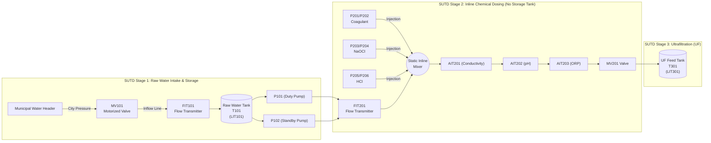
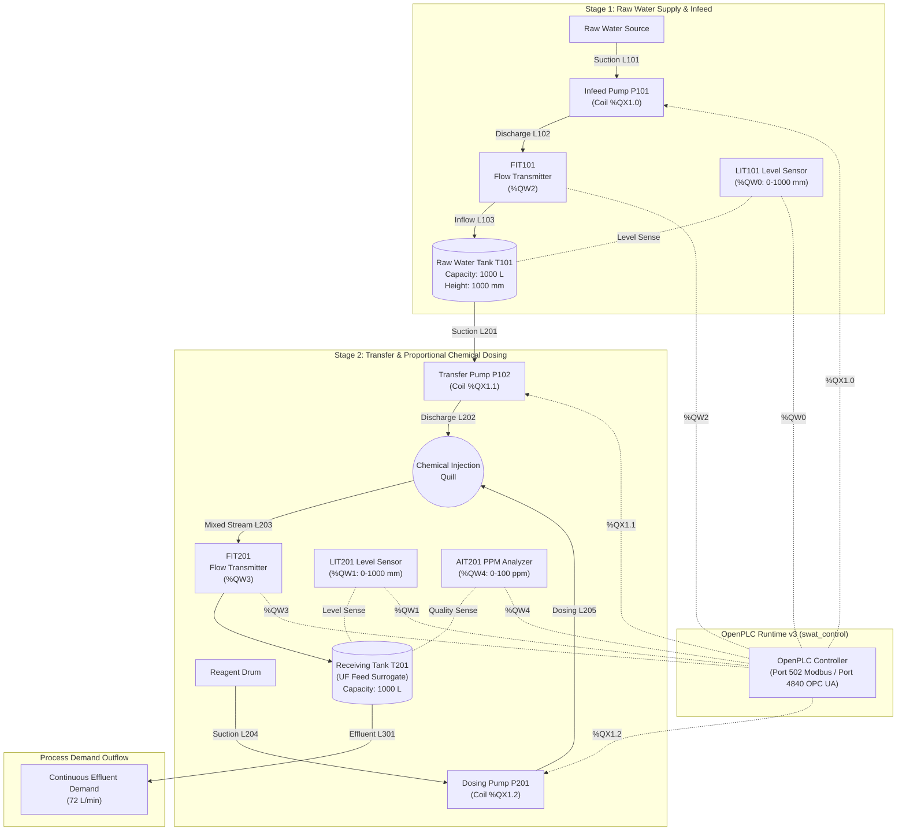

# Piping & Instrumentation Diagram (P&ID) Specification
**Document ID:** SWaT-DOC-PID-001  
**Plant Area:** Stage 1 (Raw Water Infeed & Storage) & Stage 2 (Chemical Pre-treatment & Dosing)  
**Standard:** ANSI/ISA-5.1-2009 (Instrumentation Symbols and Identification)  
**Revision:** 2.0.0 (Peer-Reviewed Critical Evaluation & Ground-Truth Alignment)  

---

## 1. Executive Summary & Provenance Evaluation

This specification establishes the Piping and Instrumentation Diagram (P&ID) for the continuous water treatment process modeled in this repository. To maintain strict academic and industrial integrity, this document explicitly distinguishes between:

1. **The Ground-Truth SUTD SWaT Physical Testbed:** The physical 6-stage operational water treatment facility built by iTrust at the Singapore University of Technology and Design (SUTD).
2. **The Phase 1 Local Reference Emulation (Digital Twin):** The containerized OpenPLC and Python simulation running in this repository.

### Ground-Truth Comparison Matrix

| System Characteristic | SUTD Physical SWaT Testbed (Ground Truth) | Phase 1 Local Reference Emulation | Technical Rationale for Adaptation |
| :--- | :--- | :--- | :--- |
| **Plant Throughput** | 5 gallons/min (**~18.9 L/min**, ~1.14 m³/h) | 120 – 150 L/min (Scaled continuous) | Scaled for faster dynamic level response during testing cycles. |
| **Stage 1 Inflow Control** | Motorized on/off valve **`MV101`** fed by municipal water utility pressure. | Infeed Pump **`P101`** pulling from raw water source. | Standalone Docker environments lack external city water header pressure; an active infeed pump makes the digital twin self-contained. |
| **P101 & P102 Allocation** | **`P101`** (Duty) and **`P102`** (Standby) redundant transfer pumps pumping from `T101` to Stage 2. | **`P101`** = Infeed Pump (fills T101); **`P102`** = Transfer Pump (T101 &rarr; Stage 2). | Split into dedicated infeed and transfer actuators to allow closed-loop mass balance across two stages without modeling valve hydraulic grid headers. |
| **Stage 2 Vessel Topology** | **No tank `T201`**. Stage 2 is an inline dosing pipe manifold leading directly into **`T301`** (UF Feed Tank in Stage 3). | Models a discrete receiving tank **`T201`** monitored by **`LIT201`**. | In Phase 1 (prior to implementing Stage 3 UF), a receiving vessel is required to complete the fluid mass balance ODE ($dV_2/dt = Q_{in} - Q_{out}$). In Stage 3, `T201` maps to `T301`. |
| **Chemical Dosing Pumps** | 6 pumps (3 duty/standby pairs): - `P201`/`P202` (NaCl / Coagulant) - `P203`/`P204` (NaOCl / Chlorination) - `P205`/`P206` (HCl / pH buffer) | Single representative dosing pump **`P201`** dosing reagent into transfer stream. | Collapsed into a single representative dosing loop for Phase 1 control logic verification; additional pumps can be enabled in Phase 3. |
| **Water Analyzers** | 3 analyzers: `AIT201` (Conductivity), `AIT202` (pH), `AIT203` (ORP). | Single analyzer **`AIT201`** measuring chemical concentration (ppm). | Representative single-channel quality analyzer. |

---

## 2. Process Architecture Diagrams

### 2.1 Authentic SUTD SWaT Stage 1 & Stage 2 P&ID (Ground Truth)

### 2.2 Phase 1 Local Reference Emulation P&ID (Current Implementation)

---

## 3. Equipment Schedule

| Tag | Physical SUTD Role | Local Emulation Role | Equipment Type | Rated Flow / Volume | Operating Pressure | Material |
| :--- | :--- | :--- | :--- | :--- | :--- | :--- |
| **T101** | Stage 1 Raw Water Tank | Stage 1 Raw Water Tank | Vertical Cylindrical Atmospheric Vessel | 1,000 L (Operating range 0–1,000 mm) | Atmospheric | HDPE / 316L SS |
| **T201** | *N/A (SUTD uses T301)* | Stage 2 Storage / UF Feed Surrogate | Vertical Cylindrical Atmospheric Vessel | 1,000 L (Operating range 0–1,000 mm) | Atmospheric | HDPE / 316L SS |
| **P101** | Raw Transfer Pump (Duty) | Raw Water Infeed Supply Pump | Centrifugal In-line Pump | 2.5 L/s (150 L/min) @ 2.5 bar | PN10 | 316L SS Impeller |
| **P102** | Raw Transfer Pump (Standby)| Transfer Pump T101 &rarr; Stage 2 | Centrifugal Booster Pump | 2.0 L/s (120 L/min) @ 2.0 bar | PN10 | 316L SS Impeller |
| **P201** | Coagulant Dosing Pump (Duty)| Primary Chemical Dosing Pump | Positive Displacement Diaphragm Metering | 0.05 L/s (3.0 L/min) @ 4.0 bar | PN16 | PTFE / PVDF |

---

## 4. Instrumentation Index

| Tag | SUTD Ground-Truth Variable | Local Emulation Variable | Calibrated Range | Output Format | OpenPLC Address | Fail-Safe State |
| :--- | :--- | :--- | :--- | :--- | :--- | :--- |
| **LIT101** | Water level in Tank T101 | Water level in Tank T101 | 0.0 – 1000.0 mm | 4–20 mA (Modbus INT) | `%QW0` | 0 mm (Low) |
| **LIT201** | *N/A (Monitored by LIT301)*| Water level in Tank T201 | 0.0 – 1000.0 mm | 4–20 mA (Modbus INT) | `%QW1` | 0 mm (Low) |
| **FIT101** | Inflow meter from MV101 | Inflow meter from Pump P101 | 0.0 – 300.0 L/min | 4–20 mA (Modbus INT) | `%QW2` | 0 L/min |
| **FIT201** | Discharge flow from P101/P102 | Transfer flow from Pump P102 | 0.0 – 300.0 L/min | 4–20 mA (Modbus INT) | `%QW3` | 0 L/min |
| **AIT201** | Conductivity Analyzer (µS/cm)| Reagent concentration (ppm) | 0.0 – 100.0 ppm | 4–20 mA (Modbus INT) | `%QW4` | 100 ppm (High) |

---

## 5. Piping & Process Line Schedule

| Line ID | Service Description | Size (DN) | SUTD Reference Equivalent | Nominal Flow |
| :--- | :--- | :--- | :--- | :--- |
| **L101** | Raw Water Suction Header | DN50 (2") | Municipal Header to MV101 | 150 L/min |
| **L102** | Infeed Flow Metering Run | DN50 (2") | Line through FIT101 | 150 L/min |
| **L103** | Tank T101 Top Inlet Nozzle | DN50 (2") | Infeed drop line into T101 | 150 L/min |
| **L201** | Transfer Pump Suction Line | DN50 (2") | T101 Drain to P101/P102 Suction | 120 L/min |
| **L202** | Transfer Pump Discharge Line| DN40 (1.5")| Discharge manifold to chemical quill | 120 L/min |
| **L203** | Dosed Transfer Process Stream| DN40 (1.5")| Static mixer line leading to T301 | 120 L/min |
| **L204** | Chemical Reagent Suction | DN15 (0.5")| Chemical stock tank feed line | 3.0 L/min |
| **L205** | Chemical Reagent Dosing Line | DN15 (0.5")| Injection quill line into L202 | 3.0 L/min |
| **L301** | Downstream Process Demand | DN40 (1.5")| Stage 3 UF feed line | 72 L/min (Continuous) |

